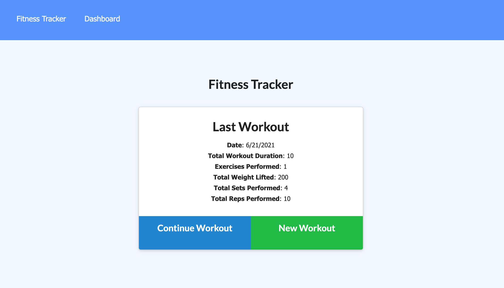
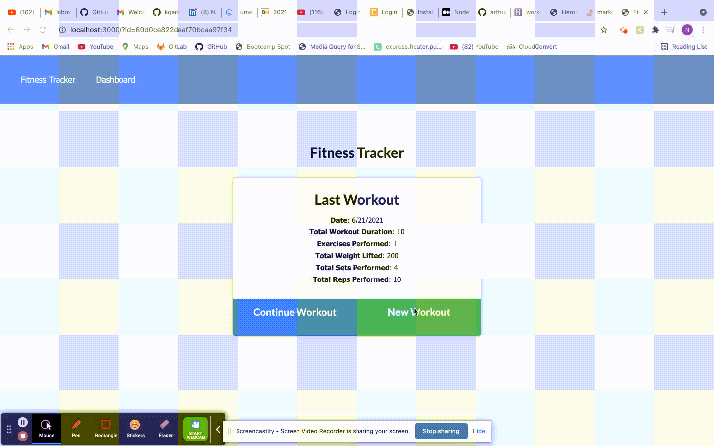
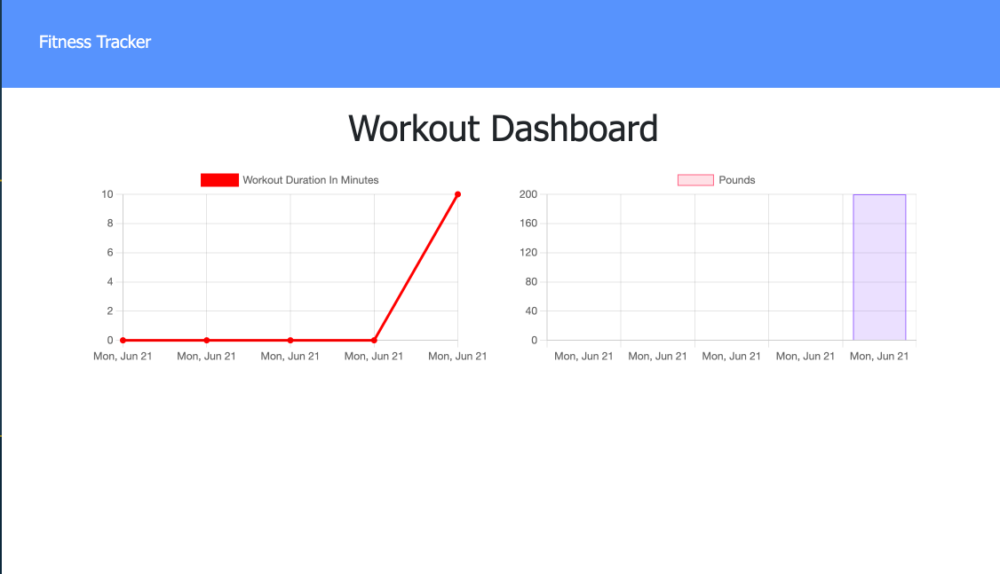

## Workout Tracker

# Description
Track your workouts with Fitness Tracker. The app will keep track of every exercise in your workout. The app dashboard will display weekly summary graphs of all workouts done in a week.

# Installation

1.Clone repository.

2.Check in routes/api and comment in block of code if you want the database to be prepopulated with dummy values.

3.npm install

4.npm seed

5.mongodb

6.npm start 

# Usage
###  Screeshots
1. Homepage
  

2. Creating Workout Tracker
    

3. Summary of Workout
  
